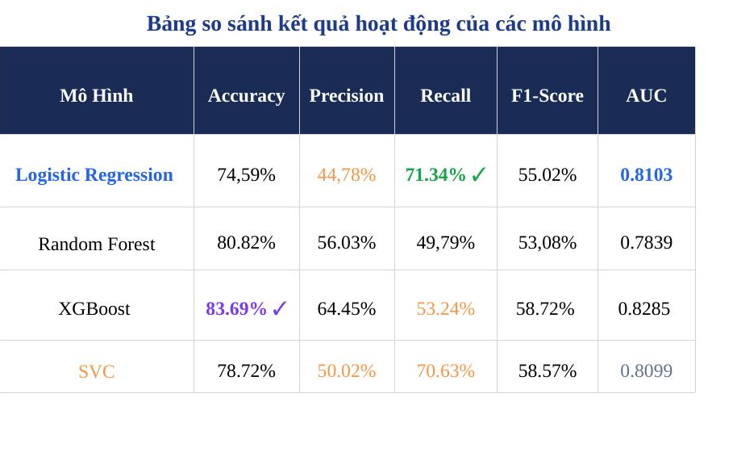
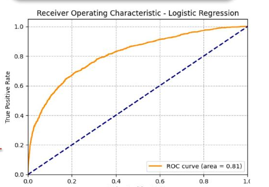
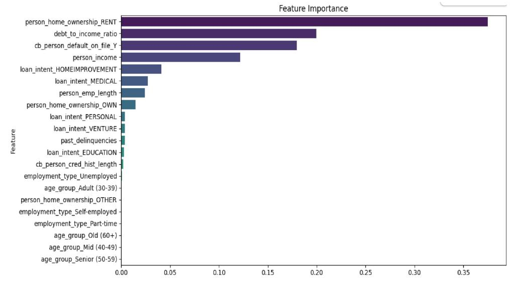

# 💳 Credit Risk Analysis — Nova Bank

Phân tích dữ liệu và xây dựng mô hình dự đoán rủi ro vỡ nợ cho Nova Bank
(hoạt động tại Mỹ, Anh, Canada), hỗ trợ ra quyết định phê duyệt khoản vay
nhằm cân bằng giữa tăng trưởng tín dụng và kiểm soát rủi ro tài chính.

---

## ❓ Vấn đề kinh doanh

Nova Bank cần cân bằng giữa hai rủi ro đối nghịch:
- Phê duyệt quá nhiều khoản vay rủi ro → tổn thất tài chính
- Thắt chặt tín dụng quá mức → bỏ lỡ doanh thu từ khách hàng tốt

**Mục tiêu phân tích:**
1. Xác định nguyên nhân gốc rễ dẫn đến vỡ nợ (default)
2. Xây dựng chân dung khách hàng có rủi ro cao
3. Xây dựng mô hình dự đoán hỗ trợ quyết định cho vay

---

## 📊 Dữ liệu

- **Nguồn**: ZoomCharts – Nova Bank Credit Risk Analysis Mini Challenge (09/2025)
- **Kích thước**: 32,576 dòng × 29 cột
- **Biến mục tiêu**: `loan_status` (0 = không vỡ nợ, 1 = vỡ nợ)
- **Tỷ lệ vỡ nợ**: 21.8% — dữ liệu mất cân bằng (imbalanced dataset)
- **Nhóm biến chính**:
  - *Cá nhân*: tuổi, thu nhập, kinh nghiệm làm việc, tình trạng sở hữu nhà, loại hình việc làm, vị trí địa lý
  - *Khoản vay & tín dụng*: số tiền vay, lãi suất, xếp hạng tín dụng (grade A→G), mục đích vay, tỷ lệ nợ/thu nhập (DTI), lịch sử vỡ nợ

---

## 🛠️ Quy trình thực hiện

### 1. Xử lý dữ liệu
- **Missing values**: xử lý có điều kiện, không fill global trung bình
  - `loan_int_rate` (9.6% null) → fill median theo `loan_grade` (bảo toàn xu hướng lãi suất tăng theo rủi ro)
  - `person_emp_length` (2.7% null) → tạo flag `emp_length_missing` + fill median theo nhóm tuổi (nhóm null có tỷ lệ vỡ nợ 31.5% vs nhóm không null 21.5% — không phải missing ngẫu nhiên, cần giữ lại tín hiệu này)
- **Wrong data**: loại 5 dòng có tuổi > 100; sửa 2 dòng có kinh nghiệm làm việc lớn hơn tuổi (lỗi nhập liệu)
- **Outliers**: giữ nguyên — qua EDA xác nhận các giá trị ngoại lai phản ánh đúng thực tế kinh doanh

### 2. Phân tích thống kê (kiểm định giả thuyết)
Dùng Chi-square, T-test, Mann-Whitney U để xác nhận mối quan hệ giữa các biến và khả năng vỡ nợ (toàn bộ p-value < 0.05):
- Sở hữu nhà × vỡ nợ: RENT 31.6% vs OWN 7.5%
- DTI × vỡ nợ: ngưỡng rủi ro hội tụ quanh DTI ~0.4
- Lịch sử vỡ nợ × hành vi tái phạm: 37.8% vs 18.4% (gấp ~2 lần)
- Thu nhập, mục đích vay, độ tuổi, lãi suất, loan grade đều có ý nghĩa thống kê

### 3. Mô hình hóa
- **Decision Tree**: xây "chân dung khách hàng vỡ nợ" — mục tiêu diễn giải quy tắc phân loại, không tối ưu accuracy
- **So sánh 4 mô hình**: Logistic Regression, Random Forest, XGBoost, SVC
- **Feature engineering**: WOE (Weight of Evidence) + IV (Information Value) cho Logistic Regression — vừa encode biến categorical, vừa binning biến numeric, đưa về cùng thang đo phản ánh rủi ro
- **Xử lý mất cân bằng dữ liệu**: SMOTE (chỉ áp dụng trên tập train, không áp dụng trên test)
- **Tối ưu**: GridSearchCV (scoring='f1') + điều chỉnh threshold theo bài toán kinh doanh

---

## 📈 Kết quả mô hình

| Model | Accuracy | Precision | Recall | F1-score | AUC |
|---|---|---|---|---|---|
| Logistic Regression | 74.59% | 44.78% | **71.34%** | 55.02% | 0.8103 |
| Random Forest | 80.82% | 56.03% | 49.79% | 53.08% | 0.7839 |
| XGBoost | **83.69%** | 64.45% | 53.24% | 58.72% | **0.8285** |
| SVC | 78.72% | 50.02% | 70.63% | 58.57% | 0.8099 |

### ✅ Mô hình được chọn: Logistic Regression + WOE encoding

Tuy XGBoost đạt Accuracy và AUC cao hơn, nhóm chọn **Logistic Regression** vì:
- **Recall cao hơn** (71.34% vs 53.24%) — quan trọng vì bài toán quản trị rủi ro ưu tiên *phát hiện được khách hàng rủi ro*, kể cả khi đánh đổi một phần Precision
- **Minh bạch và dễ diễn giải** — yêu cầu bắt buộc trong ngân hàng để giải thích quyết định từ chối/phê duyệt với khách hàng và cơ quan quản lý

Sau khi tinh chỉnh threshold (ngưỡng tối ưu = 0.5647):

| Chỉ số | Trước tinh chỉnh | Sau điều chỉnh threshold |
|---|---|---|
| Accuracy | 74.59% | 78.91% ↑ |
| Precision (1) | 44.78% | 51.29% ↑ |
| Recall (1) | 71.34% | 64.37% ↓ |
| F1-score (1) | 55.02% | 57.09% ↑ |
| AUC | 0.8103 | 0.8103 |



### 🔑 Top yếu tố ảnh hưởng (Feature Importance — Decision Tree)

1. Tình trạng sở hữu nhà (RENT) — 0.374
2. Tỷ lệ nợ/thu nhập — DTI — 0.199
3. Lịch sử vỡ nợ trong quá khứ — 0.179
4. Thu nhập (`person_income`) — 0.121
5. Mục đích vay — MEDICAL — 0.027

---

## 💡 Đề xuất kinh doanh

- **Chính sách theo phân khúc rủi ro**:
  - RENT + DTI > 0.52 → từ chối tự động
  - RENT + DTI 0.41–0.52 → giảm hạn mức, điều chỉnh lãi suất
  - Khách hàng đã từng vỡ nợ → yêu cầu lịch sử tín dụng sạch tối thiểu 24 tháng
  - Loan grade D–G kết hợp mục đích DEBTCONSOLIDATION/MEDICAL → siết chặt hoặc từ chối
- **Ngưỡng phê duyệt theo chiến lược kinh doanh**:
  - Ngưỡng bảo thủ (0.3–0.35): Recall cao, ít bỏ sót vỡ nợ — phù hợp khi thị trường rủi ro cao
  - Ngưỡng mở rộng (0.6–0.7): Precision cao — phù hợp khi muốn tăng trưởng
- **Đa dạng hóa sản phẩm vay**: micro-loan cho nhóm rủi ro cao; ưu đãi lãi suất cho mục đích EDUCATION/VENTURE (tỷ lệ vỡ nợ thấp nhất)
- **Tác động tài chính ước tính**: với hơn 7,100 khách hàng vỡ nợ hiện tại, giảm 10% tỷ lệ vỡ nợ thông qua mô hình có thể tiết kiệm hàng triệu USD tổn thất mỗi năm

---

## 🧰 Công nghệ sử dụng

`Python` `Pandas` `NumPy` `Scikit-learn` `XGBoost` `imbalanced-learn (SMOTE)` `SciPy (kiểm định thống kê)` `Matplotlib` `Seaborn`

---

## 📁 Cấu trúc Repo

```
├── Nova_Bank_Credit_risk_analysis.ipynb   # Notebook phân tích đầy đủ (EDA → Modeling)
├── CREDIT_RISK_ANALYSIS.pptx              # Slide báo cáo trình bày
└── README.md
```

---

## 🚀 Cách chạy lại project

```bash
git clone https://github.com/Hoibeopro/CREDIT_RISK_ANALYSIS.git
cd CREDIT_RISK_ANALYSIS
pip install pandas numpy scikit-learn xgboost imbalanced-learn scipy matplotlib seaborn
jupyter notebook Nova_Bank_Credit_risk_analysis.ipynb
```

---

## 👤 Tác giả

**Mã Thị Hồi** — Data Analyst Trainee
Mentor: Trương Hải Nam | Giảng viên: Hồ Thị Hương Thủy
